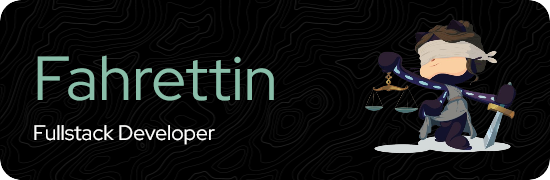

  <ul align="left" style="list-style: none">
    

      <h1>
        Fahrettin - Fullstack Developer
      </h1>
    

  </ul>

**<h3 align="left">Connect with me:</h3>** 

 <a href="https://www.linkedin.com/in/fahrettin-borsten-222920347" target="_blank">  

<h3 align="left">🚀 I create and maintain modern web applications, desktop apps, automation bots, and IoT integrations that generate real value.  
My expertise spans fullstack web development, React Native apps, Electron desktop apps, complex bots, and smart home automation with Home Assistant. </h3>

**<h3 align="left">Currently</h3>**

- 💼 I'm currently working on: **💻 Developing a secure facial recognition camera system for smart office access control.**
- 🌱 I'm currently learning: **📚 React-Native**
- 🌱 I want to learn: 

**<h2 align="left">🧪 Homelab</h2>**

Not everything runs in the cloud — some of it runs in my living room.  
I self-host and maintain a full homelab setup with production-grade services, monitoring, and access layers.

- 🐳 Dockerized everything – Containerized services for clean deployment & scaling  
- 📊 Grafana + Prometheus – Full observability stack for system & service metrics  
- 🌐 Nginx with Let's Encrypt – Reverse proxy + automated TLS certificates  
- 🧱 UFW + basic system hardening – Firewall and security best practices  
- 🏡 Home Assistant – Full smart home control and automation  
- 🔁 Dynamic DNS – Remote access to internal services  
- 🔒 Tailscale – Seamless secure mesh VPN across devices  
- 🔑 OpenVPN – Fallback VPN access with fine-grained control  

 **<h3 align="left">Skills</h3>**

                   

## Private Projects

### qowedframe  
A powerful and modular Discord bot built for Warframe enthusiasts.
qowedframe provides real-time price tracking, historical trend analysis, interactive slash commands, and customizable price alerts — all backed by a robust backend with full Warframe Market API integration, PostgresQL via Prisma ORM, and a RESTful API for external service access.

### Encrypted Electron Messenger  
A custom-built desktop messenger app using Electron, focused on end-to-end encryption and privacy.  
Designed for secure, seamless communication with modern UX, featuring encrypted messaging, offline support, and cross-platform compatibility.

### Office Mobile-App
An all-in-one employee tool designed to streamline daily office workflows: enables secure clock-in/out, seamless door access control via smart integration, and features an intuitive chat-based meal ordering system — boosting productivity and enhancing the workplace experience.

### Home Automation  
Smart home setups and custom integrations using Home Assistant and MQTT.
